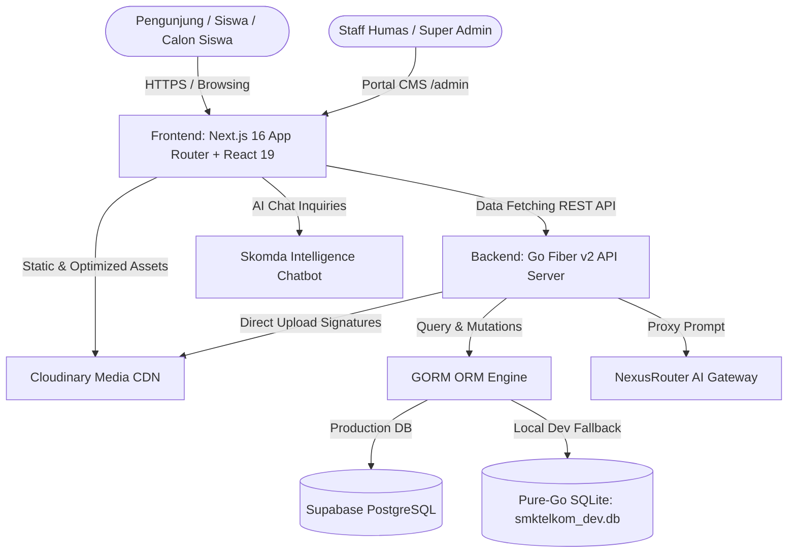
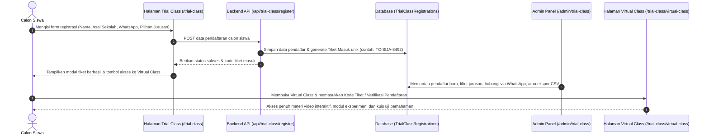

# SMK Telkom Sidoarjo


Web portal resmi dan Content Management System (CMS) terintegrasi untuk **SMK Telkom Sidoarjo (SKOMDA)**. Platform ini dirancang dengan standar industri modern untuk menghadirkan pengalaman pengguna berkecepatan tinggi (Core Web Vitals optimal), desain visual editorial modern berbasis neumorphism tactile, manajemen data sekolah yang menyeluruh, serta fitur inovasi pembelajaran vokasi digital.

---

## 📑 Daftar Isi

1. [Arsitektur Sistem](#-arsitektur-sistem)
2. [Program Keahlian Resmi](#-program-keahlian-resmi)
3. [Fitur Utama Portal Publik](#-fitur-utama-portal-publik)
4. [Fitur Panel Admin CMS](#-fitur-panel-admin-cms)
5. [Digital Talent Program (9 Spesialisasi)](#-digital-talent-program-9-spesialisasi)
6. [Alur Trial Class & Virtual Class](#-alur-trial-class--virtual-class)
7. [Stack Teknologi](#-stack-teknologi)
8. [Struktur Direktori Monorepo](#-struktur-direktori-monorepo)
9. [Panduan Instalasi & Menjalankan Proyek](#-panduan-instalasi--menjalankan-proyek)
10. [Konfigurasi Environment Variables](#-konfigurasi-environment-variables)
11. [Dokumentasi REST API](#-dokumentasi-rest-api)
12. [Quality Assurance (QA) & Pengujian](#-quality-assurance-qa--pengujian)
13. [Kontribusi & Lisensi](#-kontribusi--lisensi)

---

## 🏗️ Arsitektur Sistem

Platform ini mengadopsi pola arsitektur **Monorepo Terpisah (Decoupled Client-Server)** yang menghubungkan antarmuka web modern dengan service API backend berkecepatan tinggi:



### Keunggulan Arsitektur:
- **Server-Side Rendering (SSR) & Static Generation (SSG)**: Rendering halaman instan dengan skor performa Lighthouse dan Core Web Vitals yang tinggi.
- **Dual-Engine Backend**: Mengutamakan Go Fiber v2 (berbasis Fasthttp) untuk throughput request maksimal dengan latensi rendah, serta kompatibilitas alternatif Gin engine.
- **Resilient Database Layer**: Transisi otomatis tanpa konfigurasi rumit; berjalan mulus pada SQLite lokal saat tahap pengembangan dan terkoneksi ke Supabase PostgreSQL saat tahap deployment produksi.
- **Hybrid Media Delivery**: Aset gambar diproses dinamis oleh Cloudinary dengan optimasi format otomatis (AVIF/WebP) dan smart face detection (`g_face`), sementara ikon SVG penting disajikan secara lokal.

---

## 📚 Program Keahlian Resmi

SMK Telkom Sidoarjo menyelenggarakan 2 program keahlian vokasi unggulan bidang teknologi informasi dan telekomunikasi:

### 1. SIJA: Sistem Informasi Jaringan dan Aplikasi (Program 4 Tahun)
Program keahlian vokasi 4 tahun yang mencakup rekayasa perangkat lunak modern, arsitektur basis data skala enterprise, infrastruktur jaringan komputer, dan sistem cloud computing.
- **Software Engineering**: Pengembangan web app modern, mobile native/cross-platform, dan integrasi API.
- **Database & Cloud Computing**: Manajemen relasional (PostgreSQL, MySQL), NoSQL, dan deployment cloud infrastruktur (AWS, GCP).
- **Cybersecurity & Network**: Konfigurasi jaringan tingkat lanjut, firewalling, dan mitigasi ancaman siber.
- **Prospek Karier**: Software Engineer, Fullstack Web Developer, Mobile App Developer, Cloud/DevOps Engineer, Database Administrator, Cybersecurity Analyst.

### 2. TJAT: Teknik Jaringan Akses Telekomunikasi (Program 3 Tahun)
Program keahlian vokasi 3 tahun yang berfokus pada teknologi akses telekomunikasi modern, instalasi transmisi fiber optik, dan optimalisasi jaringan nirkabel.
- **Fiber Optic Engineering**: Penyambungan serat optik (fusion splicing), instalasi kabel udara/bawah tanah, dan pengukuran redaman dengan Optical Time Domain Reflectometer (OTDR).
- **Wireless & Radio Communication**: Perencanaan dan optimalisasi transmisi nirkabel (4G/5G, IoT, gelombang mikro / microwave).
- **Telecommunication Systems**: Infrastruktur switching, base transceiver station (BTS), dan operasional ISP.
- **Prospek Karier**: Fiber Optic Specialist, Telecommunication Field Engineer, Network Operation Center (NOC) Engineer, Wireless Network Administrator, ISP Technical Specialist.

---

## 🌟 Fitur Utama Portal Publik

### 1. Beranda Interaktif (`/`)
- Hero section dengan visual representatif siswa, statistik sekolah mengambang (floating metrics), dan akses cepat pendaftaran PPDB.
- Sambutan Kepala Sekolah dengan kutipan kepemimpinan dan dedikasi vokasi.
- Nilai keunggulan sekolah (akreditasi A unggul, kurikulum berbasis industri, serapan kerja tinggi).
- Marquee mitra industri tanpa henti (Telkom Group dan partner nasional/internasional).
- Tab interaktif program keahlian SIJA dan TJAT.
- Kurasi artikel dan kegiatan sekolah terbaru langsung dari database.
- Footer komprehensif dengan peta lokasi interaktif, direktori tautan cepat, dan kanal media sosial resmi.

### 2. Informasi Sekolah & Profil Lengkap
- **Profil Sekolah (`/tentang-kami/profil-sekolah`)**: Visi, misi, sejarah pendirian, nilai budaya, dan filosofi pendidikan Telkom Schools.
- **Hubungan Industri (`/tentang-kami/hub-industri`)**: Program kemitraan strategis, kelas industri, sertifikasi internasional, dan penyelarasan kurikulum.
- **Prestasi Siswa & Guru (`/tentang-kami/prestasi`)**: Galeri prestasi kejuaraan tingkat kabupaten, provinsi, nasional, dan internasional.
- **Sarana & Prasarana (`/tentang-kami/fasilitas`)**: Showcase laboratorium komputer, lab fiber optik, lab IoT, sarana olahraga, dan ruang kelas interaktif.
- **Direktori Guru & Tenaga Kependidikan (`/tentang-kami/profil-guru`)**: Profil tenaga pendidik dengan foto teroptimasi, bidang keahlian, dan riwayat pengajaran.
- **Akomodasi / Asrama Siswa (`/tentang-kami/akomodasi`)**: Informasi hunian asrama untuk siswa luar kota dengan pembinaan karakter intensif.

### 3. Inovasi Pembelajaran & Kejuruan
- **Profil Jurusan (`/program/profil-jurusan`)**: Detail kompetensi, silabus, dan proyeksi karir SIJA serta TJAT.
- **Ekstrakurikuler (`/program/ekstrakurikuler`)**: Katalog 15+ kegiatan pengembangan minat, bakat, kepemimpinan, dan teknologi.
- **Digital Talent Program (`/program/digital-talent`)**: Program percepatan talenta digital dengan 9 spesialisasi industri.
- **Karakter TS.21 (`/program/ts21`)**: Kurikulum pembentukan karakter abad 21 (Telkom School 21st Century Skills).
- **Trial Class Kejuruan (`/trial-class`)**: Simulasi pembelajaran kejuruan interaktif bagi calon siswa dengan form pendaftaran instan dan perolehan tiket akses digital.
- **Virtual Class (`/trial-class/virtual-class`)**: Laboratorium simulasi virtual interaktif dilengkapi materi video, modul eksperimen, dan kuis pemahaman materi.

### 4. Unit Bisnis & Bursa Karir
- **Teaching Factory (`/tefa`)**: Unit produksi karya siswa berbasis standar industri dengan katalog produk (Web, Mobile, IoT, Jaringan) dan formulir permintaan proyek industri.
- **Bursa Kerja Khusus (`/bkk`)**: Portal karir vokasi, informasi lowongan kerja aktif, program magang, rekrutmen kampus langsung, dan rekam jejak alumni.

### 5. Layanan Informasi & Aksesibilitas
- **Katalog Berita & Artikel (`/informasi/berita` & `/berita/[slug]`)**: Artikel informatif dengan filter kategori, pencarian real-time, dan fitur berbagi artikel.
- **Pengumuman Kelulusan Real-Time (`/informasi/pengumuman-kelulusan`)**: Sistem pengecekan kelulusan daring berbasis NISN dan tanggal lahir siswa secara privat dan aman.
- **Penerapan K3 Lingkungan & Laboratorium (`/informasi/penerapan-k3`)**: Standar Keselamatan dan Kesehatan Kerja, SOP penggunaan peralatan lab, APD, dan kepatuhan lingkungan.
- **Pusat Unduhan Informasi (`/unduh-informasi`)**: Repositori unduhan brosur PPDB, kalender akademik, formulir pendaftaran, dan kurikulum.
- **Informasi SPMB / PPDB (`/ppdb`)**: Informasi jalur pendaftaran, persyaratan berkas, alur seleksi, dan tautan pendaftaran langsung.

### 6. Fitur Interaktif & Utilitas Modern
- **Skomda Intelligence AI Chatbot**: Asisten virtual cerdas terintegrasi NexusRouter AI Gateway untuk melayani tanya-jawab seputar PPDB, kurikulum, jurusan, dan biaya sekolah. Dilengkapi fallback otomatis ke WhatsApp Humas resmi bila koneksi terganggu.
- **Global Search Modal (`Ctrl+K` / `Cmd+K`)**: Pencarian instan untuk menavigasi rute halaman, program keahlian, dan artikel berita.
- **Bilingual Switcher (ID / EN)**: Pengalihan bahasa instan Bahasa Indonesia (`id.json`) dan English (`en.json`) tanpa perlu reload halaman.
- **Desain Neumorphism & Tactile UI**: Elemen visual lembut bertekstur, rasio kontras warna tinggi sesuai standar WCAG 2.2 AA, dan layout responsif di semua perangkat.

---

## 🎛️ Fitur Panel Admin CMS

Panel admin dapat diakses melalui rute `/admin` dengan proteksi autentikasi token JWT:

| Modul Admin | Rute Halaman | Fungsi & Kemampuan |
|---|---|---|
| **Dashboard Overview** | `/admin` | Ringkasan statistik real-time: total berita, prestasi, guru, DTP, lowongan BKK, dokumen, dan pendaftar trial class. |
| **Manajemen Berita** | `/admin/berita` | CRUD artikel berita sekolah, kelola kategori, status draft/publish, pencarian, dan unggah cover. |
| **Digital Talent Program** | `/admin/dtp` | Pengelolaan 9 track spesialisasi DTP, kurikulum materi, alokasi mentor, dan kuota peserta. |
| **Manajemen Prestasi** | `/admin/prestasi` | Pencatatan rekam jejak juara siswa dan guru (tingkat kota, provinsi, nasional, internasional). |
| **Data Guru & Tendik** | `/admin/guru` | Direktori data pendidik, NIP, mata pelajaran, foto, kontak, dan riwayat keahlian. |
| **Bursa Kerja Khusus** | `/admin/bkk` | Publikasi lowongan pekerjaan, data mitra industri, kualifikasi pelamar, dan batas waktu pendaftaran. |
| **Pendaftar Trial Class** | `/admin/trial-class` | Manajemen pendaftar calon siswa, live search, filter jurusan/status, tombol direct WhatsApp chat, dan export data CSV. |
| **Dokumen & Unduhan** | `/admin/dokumen` | Manajemen dokumen publik yang dapat diunduh (brosur PPDB, silabus, dokumen K3). |
| **Ekstrakurikuler** | `/admin/ekskul` | Pengelolaan data klub ekskul, pembina, jadwal latihan, dan galeri kegiatan. |
| **Sarana & Fasilitas** | `/admin/fasilitas` | Inventarisasi sarana prasarana sekolah, spesifikasi laboratorium, dan dokumentasi foto. |
| **Kelulusan Siswa** | `/admin/kelulusan` | Input dan pembaruan database status kelulusan siswa berbasis NISN dan tanggal lahir. |
| **Pengaturan Website** | `/admin/pengaturan` | Konfigurasi informasi kontak humas, alamat sekolah, tautan sosial media, dan jam operasional. |
| **Audit Logs Sistem** | `/admin/audit-logs` | Jejak audit keamanan aktivitas admin untuk transparansi dan kepatuhan sistem. |

---

## 🚀 Digital Talent Program (9 Spesialisasi)

Digital Talent Program (DTP) merupakan kurikulum pengayaan industri bagi siswa SMK Telkom Sidoarjo yang terbagi ke dalam 9 bidang keahlian:

1. **Cyber Security & Ethical Hacking**: Analisis kerentanan, penetration testing, keamanan jaringan, dan incident response.
2. **Cloud Computing & DevOps**: Arsitektur serverless, kontainerisasi Docker/Kubernetes, CI/CD pipeline, dan cloud infrastructure.
3. **Fullstack Web Engineering**: Pemrograman frontend reaktif (React/Next.js) dan backend berskala besar (Go/Node.js, PostgreSQL).
4. **Mobile Application Development**: Pembangunan aplikasi mobile modern (Flutter / React Native) untuk platform iOS dan Android.
5. **IoT & Embedded Systems**: Perancangan hardware mikrokontroler (ESP32, Raspberry Pi), sensorik cerdas, dan integrasi protokol MQTT.
6. **AI & Machine Learning Engineering**: Pemodelan data, computer vision, natural language processing (NLP), dan implementasi model LLM.
7. **Fiber Optic & Telecom Specialist**: Teknik pengukuran OTDR, splicing presisi tinggi, dan instalasi jaringan FTTx enterprise.
8. **Network Automation & Infrastructure**: Otomatisasi konfigurasi jaringan dengan Python/Ansible, SD-WAN, dan perutean BGP/OSPF.
9. **UI/UX Design & Product Strategy**: Riset pengalaman pengguna, design system, interaksi mikro, dan pembuatan prototipe interaktif.

---

## 🎟️ Alur Trial Class & Virtual Class

Fitur ini memberikan simulasi pengalaman belajar nyata bagi calon siswa baru sebelum bergabung dengan SMK Telkom Sidoarjo:



---

## 💻 Stack Teknologi

| Komponen | Teknologi | Versi | Peran & Rincian |
|---|---|---|---|
| **Frontend Framework** | Next.js | `16.3.0` | App Router, Server Components, Turbopack Engine |
| **UI Library** | React | `19.2.8` | Rendering reaktif modern & state transitions |
| **Bahasa Pemrograman** | TypeScript | `5.7.3` | Type safety ketat di seluruh modul frontend |
| **CSS Framework** | Tailwind CSS | `3.4.17` | Utility-first styling & sistem token desain kustom |
| **Animasi & Interaksi** | Framer Motion | `11.15.0` | Micro-interactions, transisi rute, dan scroll animation |
| **Iconography** | Lucide React | `^1.37.0` | Set ikon antarmuka modern yang konsisten |
| **Backend Engine** | Go (Golang) | `1.23+` | Arsitektur Dual-Engine: Go Fiber v2 (default) & Gin switchable |
| **Web Framework** | Fiber v2 | `v2.52.5` | Framework web Go berbasis Fasthttp dengan performa tinggi |
| **ORM Database** | GORM | `v1.31` | Object-Relational Mapping dengan auto-migration |
| **Database Produksi** | PostgreSQL (Supabase) | Cloud | Penyimpanan relasional terpusat untuk staging dan production |
| **Database Lokal** | SQLite (Pure-Go) | Driver `glebarez` | Database lokal tanpa dependensi CGO untuk kemudahan setup |
| **Media CDN** | Cloudinary API | V2 SDK | Optimasi gambar dinamis, deteksi wajah, dan direct upload signing |
| **AI Gateway** | NexusRouter / Groq | Llama 3.3 70B | Pemrosesan asisten cerdas Skomda Intelligence |
| **Autentikasi** | Golang-JWT | `v5` | Token-based authentication untuk proteksi admin panel |

---

## 📁 Struktur Direktori Monorepo

```
Skomda-website/
├── backend/                             # Layanan REST API Backend Go
│   ├── src/
│   │   ├── api/                         # Route handlers dan controller
│   │   │   ├── admin_crud_routes.go     # CRUD endpoint komprehensif admin panel
│   │   │   ├── fiber_routes.go          # Registrasi rute & handler engine Fiber v2
│   │   │   ├── auth/                    # Otentikasi login & verifikasi JWT
│   │   │   ├── chatbot/                 # Handler proxy AI chatbot
│   │   │   ├── health/                  # Health check service status
│   │   │   ├── jurusan/                 # Handler data jurusan SIJA & TJAT
│   │   │   ├── middleware/              # Auth guard, CORS, logger, recovery
│   │   │   └── news/                    # Handler artikel berita publik
│   │   ├── client/
│   │   │   └── cloudinary/              # Generator signature & integrasi Cloudinary
│   │   ├── cmd/
│   │   │   ├── fiber/                   # Entrypoint khusus Fiber engine
│   │   │   └── server/                  # Unified entrypoint switchable (main.go)
│   │   ├── config/                      # Inisialisasi environment & koneksi database
│   │   └── models/                      # 14 model data GORM (News, DTP, BKK, User, dll.)
│   ├── smktelkom_dev.db                 # Database SQLite otomatis untuk development lokal
│   ├── Dockerfile                       # Konfigurasi container backend
│   ├── go.mod                           # Go dependencies manifest
│   └── README.md                        # Dokumentasi teknis backend
│
├── frontend/                            # Aplikasi Klien Web Next.js 16
│   ├── public/                          # Aset statis lokal (logo, SVG, ikon)
│   ├── src/
│   │   ├── app/                         # Next.js App Router (49 rute publik & admin)
│   │   │   ├── admin/                   # 12 modul CMS admin panel
│   │   │   │   ├── berita/              # Manajemen artikel berita
│   │   │   │   ├── dtp/                 # Manajemen spesialisasi DTP
│   │   │   │   ├── prestasi/            # Manajemen prestasi siswa/guru
│   │   │   │   ├── guru/                # Manajemen profil guru & tendik
│   │   │   │   ├── bkk/                 # Manajemen lowongan kerja & mitra BKK
│   │   │   │   ├── trial-class/         # Manajemen pendaftar trial class
│   │   │   │   ├── dokumen/             # Manajemen dokumen unduhan
│   │   │   │   ├── ekskul/              # Manajemen ekstrakurikuler
│   │   │   │   ├── fasilitas/           # Manajemen sarana & fasilitas
│   │   │   │   ├── kelulusan/           # Manajemen database kelulusan
│   │   │   │   ├── pengaturan/          # Pengaturan situs & kontak
│   │   │   │   └── audit-logs/          # Log jejak aktivitas admin
│   │   │   ├── berita/[slug]/           # Halaman baca berita dinamis
│   │   │   ├── informasi/               # Sub-halaman informasi, K3, kelulusan
│   │   │   ├── program/                 # Sub-halaman profil jurusan, DTP, TS21, ekskul
│   │   │   ├── tefa/                    # Teaching Factory showcase & request project
│   │   │   ├── tentang-kami/            # Profil sekolah, guru, fasilitas, asrama
│   │   │   ├── trial-class/             # Pendaftaran trial class & virtual class lab
│   │   │   ├── unduh-informasi/         # Pusat unduh brosur & berkas
│   │   │   ├── globals.css              # Styling global & animasi kustom
│   │   │   ├── layout.tsx               # Root layout dengan Font & Context Provider
│   │   │   └── page.tsx                 # Halaman Beranda utama
│   │   ├── components/                  # Komponen modular reusable
│   │   │   ├── chatbot/                 # Komponen SkomdaChatWidget & suggestion pills
│   │   │   ├── layout/                  # Navbar, Footer, Global Search Modal
│   │   │   └── sections/                # Seksi komponen per modul halaman
│   │   ├── context/                     # Provider state aplikasi (LanguageContext)
│   │   ├── data/                        # Data statis & struktur awal
│   │   ├── lib/                         # Helper URL Cloudinary & optimasi
│   │   ├── locales/                     # Kamus bilingual (id.json & en.json)
│   │   └── services/                    # Klien fetch API ke backend Go
│   ├── package.json                     # Frontend dependencies manifest
│   ├── tailwind.config.ts               # Konfigurasi Tailwind CSS
│   └── README.md                        # Dokumentasi teknis frontend
│
├── docs/                                # Panduan arsitektur, PRD, dan workflow
├── scripts/                             # Skrip automasi & audit media Cloudinary
└── README.md                            # Dokumentasi induk monorepo
```

---

## 🛠️ Panduan Instalasi & Menjalankan Proyek

### Prasyarat Sistem:
- **Node.js**: Versi `18.18.0` atau yang lebih baru (disarankan Node.js 20 LTS).
- **Go**: Versi `1.23` atau yang lebih baru.
- **Git**: Untuk clone repositori dan version control.

---

### Langkah 1: Kloning Repositori
```bash
git clone https://github.com/Nademmm/Skomda-website.git
cd Skomda-website
```

---

### Langkah 2: Setup & Jalankan Backend (Go)
1. Pindah ke direktori backend:
   ```bash
   cd backend
   ```
2. Buat file `.env` dari contoh template:
   ```bash
   cp .env.example .env
   ```
3. Unduh seluruh dependensi Go:
   ```bash
   go mod download
   ```
4. Jalankan backend server:
   ```bash
   # Menjalankan server default (Fiber v2):
   go run ./src/cmd/server
   ```
   Server backend akan aktif di `http://localhost:8080`.
   *(Catatan: Jika `DATABASE_URL` tidak diisi, backend otomatis menggunakan file SQLite lokal `smktelkom_dev.db` dan melakukan auto-seed data default).*

---

### Langkah 3: Setup & Jalankan Frontend (Next.js)
1. Buka terminal baru dan pindah ke direktori frontend:
   ```bash
   cd frontend
   ```
2. Pasang dependensi Node.js:
   ```bash
   npm install
   ```
3. Jalankan server pengembangan Next.js:
   ```bash
   npm run dev
   ```
4. Buka peramban pada alamat:
   ```
   http://localhost:3001
   ```
   *(Atau `http://localhost:3000` sesuai ketersediaan port).*

---

### Langkah 4: Akses Panel Admin CMS
- Buka tautan: `http://localhost:3001/admin`
- Masuk menggunakan kredensial bawaan awal:
  - **Username**: `admin`
  - **Password**: `admin123`
  *(Disarankan untuk segera memperbarui password setelah instalasi pertama).*

---

## ⚙️ Konfigurasi Environment Variables

### 1. Backend (`backend/.env`)
```env
ENV=development
PORT=8080

# Kosongkan DATABASE_URL untuk menggunakan SQLite lokal secara otomatis
DATABASE_URL=

# Konfigurasi Cloudinary Media Storage
CLOUDINARY_URL=cloudinary://<API_KEY>:<API_SECRET>@<CLOUD_NAME>

# Kunci Rahasia JWT untuk Autentikasi Admin
JWT_SECRET=rahasia-jwt-skomda-2026-sangat-aman

# Konfigurasi Akses Domain Frontend (CORS)
ALLOWED_ORIGIN=http://localhost:3001

# Konfigurasi AI Chatbot (NexusRouter Gateway)
NEXUS_ROUTER_URL=https://fahlyce.vercel.app
CHATBOT_MODEL=llama-3.3-70b-versatile

# Pilihan Engine Server (fiber / gin)
SERVER_ENGINE=fiber
```

### 2. Frontend (`frontend/.env.local` - Opsional)
```env
NEXT_PUBLIC_API_URL=http://localhost:8080/api
NEXT_PUBLIC_CLOUDINARY_CLOUD_NAME=pyrugvo3
```

---

## 📡 Dokumentasi REST API

Seluruh endpoint layanan berada di bawah namespace `/api`.

### 1. Layanan Publik (Tanpa Autentikasi)

| Method | Endpoint | Deskripsi |
|---|---|---|
| `GET` | `/api/health` | Pemeriksaan status kesehatan server dan engine aktif |
| `GET` | `/api/jurusan` | Daftar program keahlian resmi (SIJA & TJAT) |
| `GET` | `/api/jurusan/:slug` | Detail program keahlian berdasarkan slug |
| `GET` | `/api/news` | Daftar berita publik dengan filter `?category=` dan `?search=` |
| `GET` | `/api/news/:slug` | Detail artikel berita berdasarkan slug |
| `GET` | `/api/bkk/jobs` | Informasi lowongan kerja aktif dan kualifikasi |
| `GET` | `/api/bkk/partners` | Daftar mitra industri terpercaya BKK |
| `GET` | `/api/dtp` | Data 9 spesialisasi Digital Talent Program |
| `GET` | `/api/teachers` | Direktori guru dan tenaga kependidikan |
| `GET` | `/api/achievements` | Galeri prestasi siswa dan guru |
| `GET` | `/api/facilities` | Daftar sarana dan fasilitas sekolah |
| `GET` | `/api/extracurriculars` | Katalog kegiatan ekstrakurikuler |
| `GET` | `/api/documents` | Dokumen dan brosur yang dapat diunduh publik |
| `POST` | `/api/graduation/check` | Pengecekan kelulusan berbasis NISN dan tanggal lahir |
| `POST` | `/api/trial-class/register` | Pendaftaran peserta Trial Class baru & penerbitan tiket |
| `POST` | `/api/chatbot/message` | Pengiriman pesan ke asisten cerdas Skomda Intelligence |
| `GET` | `/api/settings/public` | Informasi kontak resmi, alamat, dan operasional |
| `GET` | `/api/cloudinary/sign` | Pengambilan tanda tangan aman untuk direct upload |

### 2. Layanan Autentikasi & Admin (Memerlukan Header `Authorization: Bearer <TOKEN>`)

| Method | Endpoint | Deskripsi |
|---|---|---|
| `POST` | `/api/auth/login` | Login admin dan penerbitan token JWT |
| `GET` | `/api/auth/me` | Memeriksa profil user admin yang sedang aktif |
| `GET` | `/api/admin/stats` | Statistik metrik ringkasan untuk dashboard admin |
| `GET, POST` | `/api/admin/news` | Ambil semua berita internal / terbitkan berita baru |
| `PUT, DELETE` | `/api/admin/news/:id` | Perbarui atau hapus berita berdasarkan ID |
| `GET, POST` | `/api/admin/dtp` | Ambil data DTP internal / tambah spesialisasi baru |
| `PUT, DELETE` | `/api/admin/dtp/:id` | Perbarui atau hapus data spesialisasi DTP |
| `GET, POST` | `/api/admin/achievements` | Ambil data prestasi internal / tambah prestasi baru |
| `PUT, DELETE` | `/api/admin/achievements/:id` | Perbarui atau hapus data prestasi |
| `GET, POST` | `/api/admin/teachers` | Ambil data guru internal / tambah guru baru |
| `PUT, DELETE` | `/api/admin/teachers/:id` | Perbarui atau hapus data guru |
| `GET, POST` | `/api/admin/bkk` | Ambil lowongan internal / tambah lowongan baru |
| `PUT, DELETE` | `/api/admin/bkk/:id` | Perbarui atau hapus data lowongan kerja |
| `GET` | `/api/admin/trial-class` | Ambil seluruh data pendaftar Trial Class & tiket |
| `PUT, DELETE` | `/api/admin/trial-class/:id` | Ubah status (Terdaftar/Hadir/Selesai) atau hapus |
| `GET, POST` | `/api/admin/documents` | Kelola repositori dokumen unduhan resmi |
| `GET, POST` | `/api/admin/extracurriculars` | Kelola data ekstrakurikuler sekolah |
| `GET, POST` | `/api/admin/facilities` | Kelola data fasilitas dan laboratorium |
| `GET, POST` | `/api/admin/graduation` | Kelola data kelulusan siswa |
| `GET, PUT` | `/api/admin/settings` | Kelola konfigurasi identitas dan kontak website |
| `GET` | `/api/admin/audit-logs` | Tinjau jejak audit aktivitas admin sistem |

---

## 🧪 Quality Assurance (QA) & Pengujian

Sebelum melakukan commit atau deployment ke lingkungan produksi, lakukan verifikasi menyeluruh:

### 1. Verifikasi Frontend
```bash
cd frontend

# 1. Typecheck: Verifikasi ketat tipe data TypeScript (harus 0 error)
npm run typecheck

# 2. Linter: Pemeriksaan standar kode ESLint
npm run lint

# 3. Production Build: Verifikasi kompilasi bundel seluruh rute App Router
npm run build
```

### 2. Verifikasi Backend
```bash
cd backend

# 1. Analisis statis sintaksis Go
go vet ./...

# 2. Jalankan rangkaian pengujian unit
go test -v ./...
```

---

## 👥 Kontribusi & Lisensi

Proyek ini dikembangkan dan dikelola untuk **SMK Telkom Sidoarjo**. Seluruh hak cipta merek dagang, logo Telkom Schools, dan konten kelembagaan merupakan milik sah Yayasan Pendidikan Telkom dan SMK Telkom Sidoarjo.

Kode sumber dilisensikan di bawah lisensi [MIT License](LICENSE).
