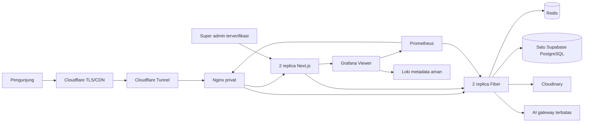
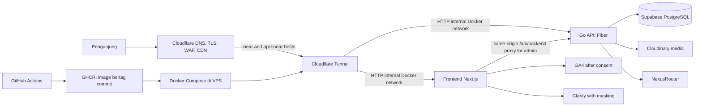

# Rancangan Arsitektur Production SKOMDA

**Status:** Implementasi diperluas sesuai persetujuan 4 Oktober; validasi deployment dan kapasitas VPS berjalan

**Tanggal:** 4 Oktober 2026

**Target awal:** Demo terkontrol pada subdomain `linear.smktelkom-sidoarjo.my.id`

## Keputusan implementasi terbaru — 4 Oktober 2026

Bagian ini menggantikan rencana penundaan Redis/load balancing/monitoring pada baseline di bawah. Bukti hasil pengujian dicatat terpisah; keberadaan konfigurasi tidak berarti kapasitas telah terbukti.

| Area | Implementasi saat ini |
| --- | --- |
| Frontend | Next.js standalone, dua replica per release; gambar Cloudinary responsif, WebP kualitas 85–90, original disimpan. |
| APIs & backend logic | Fiber production, Gin tetap kompatibel; deadline query, validasi input, error DB dilaporkan sebagai kegagalan. |
| Database & storage | Satu PostgreSQL Supabase melalui session pooler IPv4; Cloudinary media. Production tidak mempunyai fallback SQLite. |
| Auth & permissions | JWT backend; editor menangani CRUD/data operasional, super admin monitoring/audit/pengelolaan akun. MFA di luar scope sesuai permintaan. |
| Hosting & deployment | VPS yang sama; Cloudflare Tunnel ke proxy Nginx privat. Tidak ada port aplikasi/Redis/Grafana yang dibuka ke internet. |
| Cloud & compute | Docker Compose, batas CPU/RAM/thread. Mesin ini tetap merupakan satu titik kegagalan. |
| CI/CD & version control | Branch `deploy`, lint/typecheck/tests/build/Trivy sebelum publish GHCR. Tag SHA immutable. CD otomatis tanpa required reviewer; hanya branch `deploy` boleh memakai environment demo. |
| Security & RLS | Migrasi Goose pada schema privat; runtime `skomda_runtime` tanpa CREATE/superuser/BYPASSRLS, credential migrasi terpisah. RLS dan policies runtime eksplisit; grant anon/authenticated dicabut pada tabel aplikasi. |
| Rate limiting | Redis atomic shared limits untuk login/chat/form/upload dan lease concurrency AI; proteksi yang membutuhkan Redis fail closed saat Redis gagal. |
| Caching & CDN | Cache Redis public GET 30 detik, invalidasi generasi setelah perubahan, fill lock untuk mencegah stampede. Auth/admin/PII/form/tiket/health tidak di-cache. Cloudinary CDN dan Cloudflare. |
| Load balancing & scaling | Nginx least-connections ke dua frontend dan dua backend. Blue/green candidate sehat sebelum pointer trafik di-reload. Request mutasi tidak diputar ulang setelah terkirim. |
| Error tracking & logs | Prometheus, Grafana khusus super admin melalui proxy yang memverifikasi sesi, Loki untuk metadata HTTP tanpa body/URL/IP/kredensial. |
| Availability & recovery | Release sebelumnya dipertahankan untuk rollback dan static chunk browser lama. Backup terenkripsi + HMAC, retensi lokal tujuh hari, restore ke container terisolasi. Offsite otomatis/notifikasi membutuhkan tujuan yang disediakan pemilik. |
| Analytics UI/UX | GA4/Clarity hanya setelah persetujuan; admin/form sensitif dikecualikan. Aktivasi menunggu ID yang benar. |

### Deployment dan rollback

`compose.yaml` menampung infrastruktur stabil. `compose.release.yaml` menampung release `blue` atau `green`, masing-masing dua frontend dan dua backend. `scripts/deploy-demo.sh` memakai lock VPS, menjalankan migrasi yang kompatibel dengan versi aktif, menunggu semua health checks candidate, memvalidasi konfigurasi Nginx, lalu reload pointer secara graceful. Kegagalan sebelum switch tidak mengganti release aktif; kegagalan setelah switch mengembalikan pointer.

Keseragaman cookies/JWT, database, Redis, dan origin menghindari sticky session untuk API stateless. Versi frontend/backend harus tetap kompatibel selama pergantian. Database rollback tidak dilakukan otomatis; migrasi selanjutnya wajib bersifat additive/backward-compatible. Static assets versi sebelumnya tetap tersedia selama satu release; tab yang jauh lebih lama perlu refresh.

### Batas nyata VPS

Provider membatasi total proses/thread ke **500**, bukan hanya RAM/CPU. Audit awal menemukan 468 sudah terpakai. Override worker Apache dan GOMAXPROCS containerd menurunkan pemakaian tanpa menghapus layanan lama. Nginx memakai dua worker, nofile 8192; backend GOMAXPROCS 2 dan pool 8/2 per replica. Batas RAM per frontend 384 MiB dan backend 192 MiB, termasuk dua slot saat CD. Monitoring mendapat batas tersendiri.

Target **1.000 pengguna bersamaan** diukur dengan workload, pacing, durasi, error dan p95 yang tercatat. Target ini bukan jaminan 1.000 request berat per detik, 1.000 percakapan AI simultan, atau tahan setiap bentuk serangan. Hasil uji VPS dan batas generator dicatat dalam laporan akhir. Domain utama tetap menunggu persetujuan promosi terpisah.

Tahapan: **B** hardening data/operasi → **C** monitoring/analytics/performa → **D** validasi scaling dan stress test demo. Pekerjaan tidak dinyatakan selesai hanya karena pipeline hijau.

---

## Baseline dan konteks keputusan sebelumnya

Panduan konfigurasi manual VPS dan GitHub ada di [`demo-vps-runbook.md`](demo-vps-runbook.md).

Prosedur load test baca-saja untuk subdomain demo ada di [`stress-testing.md`](stress-testing.md).

Audit baca-saja Supabase untuk pemilik proyek tersedia di [`supabase-access-audit.md`](supabase-access-audit.md).

Prosedur backup dan recovery serta status prasyaratnya ada di [`backup-and-recovery-runbook.md`](backup-and-recovery-runbook.md).

Konfigurasi persetujuan dan ID analytics ada di [`analytics-consent.md`](analytics-consent.md).

Snapshot operasional, rancangan alert, dan diagnosis insiden ada di [`monitoring-and-incidents.md`](monitoring-and-incidents.md).

Dokumen ini menjadikan daftar kebutuhan infrastruktur sebagai cakupan arsitektur proyek. Status membedakan kemampuan yang sudah tampak di repo dari rancangan yang masih memerlukan implementasi atau konfigurasi akun/server.

## Tujuan dan batasan

- Menjalankan stack frontend dan backend yang sudah ada tanpa memindahkan domain utama sebelum demo stabil dan pemilik menyetujuinya.
- Menjaga PostgreSQL sebagai satu-satunya sumber data runtime production. SQLite boleh dipakai secara eksplisit untuk pengembangan lokal atau test terisolasi, tanpa fallback diam-diam ketika database gagal.
- Memanfaatkan VPS yang tersedia dan layanan yang sudah dipakai (Supabase dan Cloudinary); hindari Kubernetes atau layanan berbayar tambahan sebelum ada kebutuhan nyata.
- Menyelesaikan jalur demo lebih dahulu. High availability lintas mesin dan autoscaling bukan sasaran awal pada satu VPS.

## Arsitektur target

Demo menjalankan satu frontend Next.js dan satu Go API container di Docker Compose. Keduanya hanya bind ke loopback host ports dan juga berada pada network Docker privat. Connector `cloudflared` bergabung ke network tersebut; hostname `linear` diarahkan ke `http://frontend:3000`, sedangkan `api-linear` dapat diarahkan ke `http://backend:8080` untuk API publik/health. Request admin dari browser tetap satu origin di `linear`; Next.js meneruskannya ke Go lewat network privat. TLS publik berakhir di Cloudflare, sedangkan HTTP dipakai pada koneksi internal Docker. Webuzo tetap mengelola panel server. Go API menggunakan Supabase PostgreSQL melalui `DATABASE_URL`, Cloudinary untuk media, dan NexusRouter untuk chatbot.

## Cakupan komponen

| Area | Pilihan target | Kondisi repo saat ini dan keputusan |
|---|---|---|
| Frontend | Next.js App Router untuk website publik dan CMS yang tersedia | Next.js sudah ada; Dockerfile dan standalone output disiapkan. Framework UI tidak digabung ke backend Go. |
| APIs & Backend Logic | Go API, Fiber sebagai engine production; Gin tetap alternatif yang diuji | Kedua entrypoint tersedia. Production menjalankan satu engine saja. API tetap menjadi jalur mutasi dan akses data. |
| Database & Storage | Supabase PostgreSQL untuk staging/production; Cloudinary untuk gambar/dokumen media | Backend mewajibkan Postgres di Compose production. SQLite dipilih eksplisit via `DATABASE_DRIVER=sqlite` hanya pada `development` atau `test`; tidak ada fallback koneksi. Production server hanya membuka dan ping database; migrasi dan seed tidak berjalan saat HTTP server start. Pool SQL backend dibatasi 25 koneksi terbuka, 5 idle, usia maksimum 15 menit, idle maksimum 5 menit; nilai ini perlu dibandingkan dengan limit Supabase sebelum stress test. Endpoint upload production gagal dengan `503` jika Cloudinary belum siap/gagal; penyimpanan lokal hanya fallback development. |
| Auth & Permissions | JWT backend, password bcrypt, role checks API, cookie HttpOnly untuk admin | JWT HS256 berlaku 24 jam dan diverifikasi dengan pembatasan algoritma serta issuer/expiry; cookie memakai `HttpOnly`, `Secure` di production, dan `SameSite=Lax`. Backend memeriksa ulang keberadaan dan role akun dari database pada setiap request. Role Editor/Super Admin sudah digunakan; endpoint sensitif dibatasi ke Super Admin. Login berada di `/gate-internal-skomda`, tetapi URL tersembunyi bukan kontrol keamanan. MFA sengaja ditunda ke tahap hardening berikutnya. |
| Hosting & Deployment | Ubuntu VPS + Docker Compose + Cloudflare Tunnel; `linear` frontend demo | Published route `linear` mengarah ke frontend. Next.js meneruskan request admin ke backend melalui `http://backend:8080/api` di network Docker. `api-linear` dapat tetap dipakai oleh endpoint publik dan health check. Panel Webuzo tetap pada hostname `server`. |
| Cloud & Compute | VPS saat ini; Supabase dan Cloudinary sebagai layanan terkelola | Kapasitas awal cukup untuk satu replica per aplikasi menurut spesifikasi VPS yang diberikan. Container frontend/backend/migrator berjalan non-root, tanpa Linux capabilities, dan dengan `no-new-privileges`; batas CPU/RAM tetap diterapkan dan pemakaian perlu dipantau. |
| CI/CD & Version Control | GitHub Actions untuk pemeriksaan, build, image GHCR immutable SHA, scan image, deploy demo opsional | Workflow berada di branch `deploy`; deploy hanya berjalan pada push ke branch itu setelah pemeriksaan backend/frontend, build image, dan scan Trivy sukses, lalu memerlukan secrets/variables environment `demo` serta repository variable `DEMO_DEPLOY_ENABLED=true`. Scan memblokir CVE High/Critical yang sudah memiliki perbaikan sebelum deploy VPS. Di VPS, skrip memeriksa keberadaan dan mode `600` untuk file environment serta memvalidasi konfigurasi Compose secara senyap sebelum pull image atau menjalankan migrasi. Pipeline demo tidak mengubah domain utama. |
| Security & RLS | Secret di VPS/GitHub Secrets; TLS; CORS allowlist; JWT; least privilege; audit kebijakan RLS | Secret production berada di environment VPS, bukan browser/repo. CORS Fiber dan Gin kini memakai origin konfigurasi saja di production; startup production gagal bila `ALLOWED_ORIGIN` kosong atau bukan origin HTTPS. Backend Go tersambung langsung ke PostgreSQL. Container tidak mendapat Linux capabilities dan proses dilarang memperoleh hak tambahan. Role endpoint telah diperiksa secara statis; detail audit baru tidak lagi menyalin data dari record. Policy/grants dan role koneksi database masih perlu diaudit. Lihat [`security-authorization-audit.md`](security-authorization-audit.md). |
| Rate Limiting | Batas khusus endpoint sensitif; Cloudflare edge rules untuk abuse umum | Implementasi repo memakai IP dari `CF-Connecting-IP` (fallback ke peer IP): login 5/menit, chatbot 60/menit serta maksimum 16 proses serentak, submit lowongan 5/10 menit, pendaftaran Trial Class 10/10 menit, dan cek tiket 30/menit. Endpoint upload memerlukan JWT admin tetapi belum memiliki rate/concurrency limit khusus. Counter in-memory hanya berlaku per proses/satu replica. Konfigurasi live Cloudflare dan efektivitas limit masih perlu diverifikasi saat pengujian VPS. |
| Caching & CDN | Cloudflare untuk aset publik yang aman; Cloudinary untuk media; cache API/Next ditentukan per route | Redis belum menjadi bagian baseline. Aset publik disalurkan melalui Cloudflare/Cloudinary; kebijakan cache API belum ditetapkan per endpoint. Redis baru ditambahkan bila pengukuran menunjukkan kebutuhan cache server-side atau state bersama lintas replica. Jangan cache auth, admin, data pribadi, atau mutasi. |
| Load Balancing & Scaling | Satu VPS, satu frontend, satu backend pada fase demo; tambah replica/host bila metrik menuntut | Belum ada load balancer aplikasi. Cloudflare Tunnel merutekan hostname ke service, bukan membagi beban ke beberapa app replica. Proxy/load balancer dalam satu VPS hanya membantu membagi proses dan tetap memiliki single point of failure. Load balancing lintas host baru memberi redundansi jika ada lebih dari satu host/origin. Jika backend direplikasi, rate limiter harus memakai storage bersama seperti Redis dan koneksi Supabase harus dibatasi. |
| Error Tracking & Logs | stdout/stderr container dengan rotasi dan request ID; agregasi/error tracker setelah demo dasar stabil | Next.js proxy membuat `X-Request-ID` UUID baru dan meneruskannya ke Go; backend juga membuat UUID bila menerima request langsung/tanpa ID. Log frontend mencatat penolakan proxy dengan ID/status/alasan umum; log backend berisi ID, method, route template, status, dan durasi—tanpa body, query, IP, atau kredensial. Compose membatasi ukuran/jumlah file log. Skrip snapshot VPS dan panduan monitor/insiden tersedia; agregasi, error tracker, collector resource dan alert eksternal belum aktif. |
| Availability & Recovery | Health checks DB-aware, restart policy, rollback image, backup independen, prosedur restore | API health memeriksa koneksi database dan mengirim `Cache-Control: no-store`; Compose mengatur restart dan readiness dependency. Skrip snapshot VPS dan runbook monitor/insiden tersedia. Workflow mendukung rollback image, tetapi rollback tidak membatalkan migrasi database. Backup independen, retensi, konfigurasi alert eksternal serta uji restore belum disiapkan. Satu VPS tetap single point of failure. |
| Google Analytics | GA4 untuk trafik dan sumber kunjungan publik | Consent-gated page view sudah dibuat; event konversi belum ditambahkan. Butuh Measurement ID dari pemilik properti GA4. Jangan mengirim PII atau merekam panel admin. |
| UI/UX Analytics | Microsoft Clarity untuk heatmap/session replay terbatas dan temuan usability | Consent banner, consent-gated loading, pengecualian route sensitif, dan masking `<form>` sudah dibuat. GA4 Measurement ID dan Clarity Project ID belum diatur, jadi integrasi tetap nonaktif. Belum ada event konversi khusus. |

## Keamanan data dan observabilitas

1. Browser tidak pernah menerima `DATABASE_URL`, Cloudinary API secret, JWT signing secret, password seed admin, atau SSH key. Jika operator meminta `--seed-initial` di production, `ADMIN_DEFAULT_PASSWORD` wajib kuat; server runtime tidak memakai password seed.
2. Daftar dokumen publik dibatasi ke `is_public=true`; daftar admin menggunakan `/admin/documents`. Endpoint publik alumni hanya mengirim kolom yang layak diumumkan; NISN dan data lengkap hanya lewat `/admin/alumni` dengan JWT. Data alumni privat tidak lagi dikirim sebagai fallback statis frontend.
3. Route admin Go memvalidasi JWT dan mengambil role/keberadaan akun terbaru dari database pada setiap request. Login melalui `/api/backend/auth/login` mengeluarkan cookie `HttpOnly` untuk host frontend. Proxy Next.js meneruskan cookie ke backend di network Docker privat dan memeriksa `Origin` pada mutasi. Route halaman Next.js hanya menyembunyikan UI; backend tetap menjadi batas otorisasi. MFA belum termasuk tahap ini.
4. Production fail-closed: jika PostgreSQL kosong/tidak terjangkau, backend tidak start dan health check gagal. Tidak ada penulisan ke SQLite sebagai fallback.
5. Backend memakai koneksi PostgreSQL langsung, bukan Supabase Data API untuk query aplikasi. Karena itu, audit harus mencakup role koneksi Go, grants, owner/superuser, policies, dan akses `anon`/`authenticated`. `ENABLE ROW LEVEL SECURITY` sendiri tidak membuktikan tabel terlindungi jika role aplikasi dapat melewati RLS atau grants masih terlalu luas. Rekomendasi target: role runtime khusus dengan hak minimum dan proses migrasi terpisah.
6. Rate limiter in-memory cukup untuk satu replica demo, tetapi bukan kontrol lintas replica. Redis belum dipasang karena saat ini tidak ada kebutuhan shared state/cache yang terukur. Jika backend direplikasi, pindahkan limiter ke Redis atau layanan storage bersama; untuk chatbot, backend membaca `CF-Connecting-IP` karena akses publik masuk melalui Cloudflare Tunnel dan port backend hanya bind ke loopback VPS. Terapkan edge rules Cloudflare dan pantau false positive sebelum memperketat batas publik.
7. Request logs hanya memuat metadata operasional yang diperlukan. Hapus atau redaksi Authorization, cookie, password, JWT, connection string, dan data calon siswa.
8. Analytics hanya aktif di area publik setelah persetujuan eksplisit dan mengikuti pengaturan privasi sekolah. Banner memberi pilihan Terima/Tolak dan pilihan dapat diubah kapan saja. GA4 hanya menerima pathname page view; event konversi belum ditambahkan karena perlu disepakati. Halaman admin/login, pendaftaran, permintaan layanan, pencarian hasil kelulusan dikecualikan. Clarity menerima halaman publik yang diizinkan; semua form diberi masking sebelum script dimuat.

## Tahapan implementasi

### Tahap A — Demo aman di subdomain (baseline berjalan)

- Pertahankan driver lokal yang eksplisit; production tetap PostgreSQL-only dan pastikan `.env` VPS menggunakan `DATABASE_DRIVER=postgres`.
- Bereskan kontrak konfigurasi Compose/API/frontend, validasi health check, dan dokumentasikan setup Cloudflare Tunnel untuk `linear` dan `api-linear`.
- Jalankan CI build/test, publish image bertag commit ke GHCR, lalu aktifkan deploy demo hanya setelah pemilik mengisi secrets/variables VPS.
- Pemilik sudah menjalankan deployment demo dan mengonfirmasi API health `200` serta database `ok`. Pemeriksaan live yang lebih luas dan stress test VPS tetap dijadwalkan di tahap akhir; status repo saja bukan bukti semua jalur live sehat.

### Tahap B — Hardening data dan operasi (pekerjaan berikutnya)

- Pastikan kepemilikan/akses pemulihan project Supabase dan lingkungan demo vs production. Jangan menjadikan project milik pihak lain satu-satunya data produksi tanpa kesepakatan akses, backup, dan pemulihan.
- Audit role/grants/policies RLS dan izin setiap endpoint. Pisahkan role runtime berhak minimum dari role migrasi; jangan membuka tabel ke Data API tanpa alasan.
- Audit kode awal menemukan detail audit log sebelumnya dapat menyimpan PII; branch ini meminimalkan detail untuk log baru. Baris historis tetap perlu keputusan pemilik tentang retensi/pembersihan. Verifikasi role endpoint di demo; lihat [`security-authorization-audit.md`](security-authorization-audit.md).
- Command `/app/migrate` sekarang memakai SQL migrations Goose berversi yang di-embed di image; GORM `AutoMigrate` hanya dipakai development/test. Baseline versi 1 disusun dari schema-only dump Supabase 4 Oktober 2026 dan tidak menyalin GRANT/default ACL yang luas. Ledger Goose disimpan di schema privat `skomda_internal`. Database existing belum mencatat baseline dan image ini belum dideploy. Untuk adopsi, migrator mencocokkan nama 17 tabel beserta kolomnya, 64 indeks, 17 sequence, 7 tabel RLS, dan 2 policy sebelum menulis versi 1 tanpa menjalankan DDL aplikasi. Pemeriksaan tidak mencocokkan tipe/default kolom atau definisi penuh constraint/index; operator tetap harus membandingkan dump terbaru dan memastikan tak ada perubahan schema setelah dump. Migrator memakai `backend/migrate.env`; role PostgreSQL khusus migrasi belum dipisah dari role runtime.
- Upload production sekarang fail-closed ke Cloudinary; konfirmasi proteksi efektif login, chatbot, dan endpoint pendaftaran serta limit Cloudflare saat pengujian VPS.
- Pool koneksi SQL saat ini dibatasi 25 terbuka/5 idle pada satu backend. Cocokkan dengan paket/connection pool Supabase dan jumlah replica sebelum menentukan concurrency stress test atau mengubah batas.
- Implementasikan backup Postgres terenkripsi di lokasi terpisah, retensi dan alert, lalu lakukan uji restore yang disetujui pemilik database. Runbook sudah tersedia; backup otomatis dan latihan restore belum ada. Backup provider tidak menggantikan salinan independen dan latihan restore.
- Sasaran awal yang diusulkan: RPO 24 jam dan RTO 4 jam; nilainya belum teruji/terjamin. Prosedur dan prasyarat ada di [`backup-and-recovery-runbook.md`](backup-and-recovery-runbook.md). Database dan media Cloudinary harus dipulihkan terpisah.
- Request ID UUID dan access log backend sudah ditambahkan di branch ini; perubahan baru terlihat pada demo setelah image berisi commit tersebut dideploy. Berikutnya lengkapi agregasi/error tracking, alert uptime dan kapasitas VPS.
- Skrip `vps-status.py` memeriksa container, OOM, disk/RAM dan probe website/API/proxy tanpa menampilkan secret. Pipeline menyalin skrip ke VPS sebelum deploy aplikasi; operator menjalankannya sendiri. Health API menambahkan `Cache-Control: no-store`. Panduan tiga monitor eksternal dan penanganan insiden tersedia di [`monitoring-and-incidents.md`](monitoring-and-incidents.md); konfigurasi alert dan pemeriksaan live tetap diperlukan.

### Tahap C — Analitik dan optimasi pengalaman

- Consent-gated integration GA4/Clarity, pilihan Terima/Tolak, masking form, dan daftar route sensitif sudah ada di branch ini. Tracking tetap nonaktif sampai pemilik membuat Repository variables untuk kedua ID.
- Sebelum memasukkan ID: lengkapi disclosure kebijakan privasi sekolah dan konfigurasi GA4 agar pageview browser-history otomatis dimatikan; pastikan Clarity tidak membuka masking.
- Event conversion belum dikirim. Sepakati event yang aman (misalnya kategori klik CTA/unduh brosur) sebelum menambahkannya.
- Evaluasi cache route publik, Core Web Vitals, aksesibilitas, dan temuan heatmap/session replay; prioritaskan perbaikan UI/UX berdasarkan bukti.

### Tahap D — Promosi domain utama dan scaling

- Alihkan domain utama hanya setelah checklist demo, backup/restore, keamanan, pemantauan, dan rollback lulus serta pemilik memberi persetujuan.
- Tambah Redis saat diperlukan shared cache/rate-limit state, dan tambah load balancer/replica hanya bila hasil pengukuran atau target availability membutuhkannya. Untuk satu VPS, load balancer lokal tidak memberi redundansi host; HA memerlukan lebih dari satu host/origin dan mekanisme failover.

## Keputusan dan prasyarat yang masih diperlukan

- Pemilik Supabase perlu memastikan proyek/akun memiliki akses operasional dan memberi izin untuk backup/restore serta konfigurasi role; kredensial tidak dikirim lewat chat.
- Pemilik perlu menambahkan SSH deploy secrets ke GitHub Environment `demo` dan mengatur variabel path VPS sebelum auto-deploy demo diaktifkan.
- Docker Scout tambahan tetap opsional dan membutuhkan konfigurasi Docker Hub bila diaktifkan. Trivy menjadi gate wajib untuk image GHCR; hasilnya perlu ditinjau bila temuan baru memblokir build, bukan diabaikan atau ditekan tanpa analisis.
- GA4 Measurement ID dan Clarity Project ID adalah GitHub Repository variables yang diperlukan untuk mengaktifkan tracking pada image build berikutnya; jika kosong, frontend tidak memuat script analytics.
- Retensi backup dan lokasi salinan independen perlu diputuskan bersama sebelum mengaktifkan backup otomatis.
- Pemilik Cloudinary perlu memastikan akses pemulihan akun dan menyetujui apakah file asli harus disalin ke lokasi independen; manifest aset saja bukan backup.
- `smktelkom-sidoarjo.my.id` tetap di luar pipeline demo sampai persetujuan promosi domain utama.

## Risiko/hal yang perlu diselesaikan

- Repo dan dokumentasi lama memiliki beberapa pernyataan yang tidak konsisten soal SQLite, RLS, rate limit, dan status fitur. Dokumen ini adalah target rancangan, bukan bukti semua kontrol telah terpasang.
- Proyek Supabase dimiliki teman. Ketergantungan akun dan akses pemulihan perlu disepakati agar operasional tidak bergantung pada satu orang.
- Satu VPS adalah single point of failure; health check dan restart membantu pemulihan proses, tetapi tidak melindungi dari kegagalan host atau jaringan.
- Role PostgreSQL runtime dan migrasi saat ini belum dipisahkan. Siapkan runtime role berhak minimum dan role migrasi DDL terbatas setelah pemilik project menyetujui grants dan backup. Baseline migrasi versi 1 membandingkan nama objek inti; ia tidak memverifikasi setiap tipe/default/constraint/index, sehingga perlu dicocokkan dengan dump schema terbaru sebelum dipakai.
- Fallback upload ke disk lokal sekarang hanya aktif di development; di production kegagalan Cloudinary menghasilkan `503` agar aplikasi tidak menyimpan URL file sementara sebagai sukses. Filesystem container tetap bukan storage durable dan Cloudinary membutuhkan akses pemulihan akun/offsite media sesuai target RPO.
- CORS bukan pengganti autentikasi atau otorisasi. Pastikan `ALLOWED_ORIGIN` pada VPS berisi origin frontend production yang tepat (tanpa path), lalu verifikasi setelah deploy.
- Dokumen ini menggambarkan arsitektur target dan status yang terbaca di branch `deploy`, bukan hasil verifikasi konfigurasi live. Validasi deploy, stress test, backup/restore, dan pemantauan tetap dijalankan pada tahap operasional.
