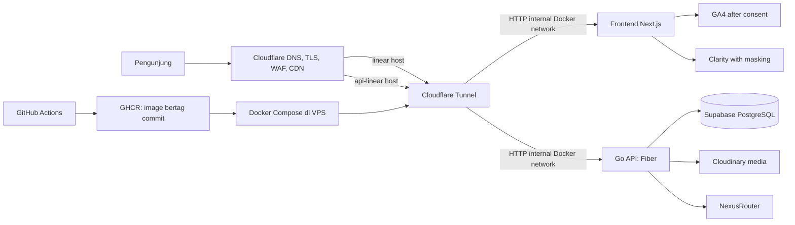

# Rancangan Arsitektur Production SKOMDA

**Status:** Baseline disetujui; implementasi bertahap

**Tanggal:** 3 Oktober 2026

**Target awal:** Demo terkontrol pada subdomain `linear.smktelkom-sidoarjo.my.id`

Panduan konfigurasi manual VPS dan GitHub ada di [`demo-vps-runbook.md`](demo-vps-runbook.md).

Dokumen ini menjadikan daftar kebutuhan infrastruktur sebagai cakupan arsitektur proyek. Status membedakan kemampuan yang sudah tampak di repo dari rancangan yang masih memerlukan implementasi atau konfigurasi akun/server.

## Tujuan dan batasan

- Menjalankan stack frontend dan backend yang sudah ada tanpa memindahkan domain utama sebelum demo stabil dan pemilik menyetujuinya.
- Menjaga PostgreSQL sebagai satu-satunya sumber data runtime production. SQLite boleh dipakai secara eksplisit untuk pengembangan lokal atau test terisolasi, tanpa fallback diam-diam ketika database gagal.
- Memanfaatkan VPS yang tersedia dan layanan yang sudah dipakai (Supabase dan Cloudinary); hindari Kubernetes atau layanan berbayar tambahan sebelum ada kebutuhan nyata.
- Menyelesaikan jalur demo lebih dahulu. High availability lintas mesin dan autoscaling bukan sasaran awal pada satu VPS.

## Arsitektur target

Demo menjalankan satu frontend Next.js dan satu Go API container di Docker Compose. Keduanya hanya bind ke loopback host ports dan juga berada pada network Docker privat. Connector `cloudflared` bergabung ke network tersebut; Cloudflare Tunnel merutekan hostname frontend ke `http://frontend:3000` dan hostname API ke `http://backend:8080`. TLS publik berakhir di Cloudflare, sedangkan HTTP dipakai pada koneksi internal Docker. Webuzo tetap mengelola panel server dan bukan reverse proxy untuk dua hostname demo ini. Go API menggunakan Supabase PostgreSQL melalui `DATABASE_URL`, Cloudinary untuk media, dan NexusRouter untuk chatbot.

## Cakupan komponen

| Area | Pilihan target | Kondisi repo saat ini dan keputusan |
|---|---|---|
| Frontend | Next.js App Router untuk website publik dan CMS yang tersedia | Next.js sudah ada; Dockerfile dan standalone output disiapkan. Framework UI tidak digabung ke backend Go. |
| APIs & Backend Logic | Go API, Fiber sebagai engine production; Gin tetap alternatif yang diuji | Kedua entrypoint tersedia. Production menjalankan satu engine saja. API tetap menjadi jalur mutasi dan akses data. |
| Database & Storage | Supabase PostgreSQL untuk staging/production; Cloudinary untuk gambar/dokumen media | Backend mewajibkan Postgres di Compose production. SQLite dipilih eksplisit via `DATABASE_DRIVER=sqlite` hanya pada `development` atau `test`; tidak ada fallback koneksi. |
| Auth & Permissions | JWT backend, password bcrypt, role checks API, cookie httpOnly untuk admin | Auth dan role guards ada. Middleware Next.js hanya memeriksa keberadaan cookie untuk menyamarkan route; validasi otorisasi wajib tetap di API. |
| Hosting & Deployment | Ubuntu VPS + Docker Compose + Cloudflare Tunnel; `linear` frontend dan `api-linear` API demo hosts | Published routes `linear` dan `api-linear` mengarah ke container yang sesuai. Homepage merespons HTTP 200 dan API health mengonfirmasi database PostgreSQL sehat. Panel Webuzo tetap pada hostname `server`; resolver DNS bawaan komputer pemilik sempat memberi `NXDOMAIN` sementara resolver publik berhasil. |
| Cloud & Compute | VPS saat ini; Supabase dan Cloudinary sebagai layanan terkelola | Kapasitas awal cukup untuk satu replica per aplikasi menurut spesifikasi VPS yang diberikan. Batasi CPU/RAM container dan pantau pemakaian. |
| CI/CD & Version Control | GitHub Actions untuk pemeriksaan, build, image GHCR immutable SHA, deploy demo opsional | Workflow disiapkan di branch `deploy`; deploy memakai secrets dan variables pada environment `demo`, sedangkan sakelar job `DEMO_DEPLOY_ENABLED` harus berupa repository variable. Pipeline demo tidak mengubah domain utama. |
| Security & RLS | Secret di VPS/GitHub Secrets; TLS; CORS allowlist; JWT; least privilege; kebijakan RLS yang terverifikasi | CORS/JWT tersedia dan beberapa tabel mengaktifkan RLS dari startup code. RLS belum boleh dianggap perlindungan efektif sebelum policy, grants, dan role koneksi diverifikasi. |
| Rate Limiting | Batas khusus endpoint sensitif; Cloudflare edge rules ditambahkan untuk abuse umum | Login 5 request/menit dan chatbot 15 request/menit tercatat di kode. Chatbot limiter bersifat in-memory dan tidak berbagi counter antar replica. |
| Caching & CDN | Cloudflare untuk aset publik yang aman; Cloudinary untuk media; cache API/Next ditentukan per route | Cloudinary sudah digunakan. Jangan cache respons admin, auth, personal data, atau API mutasi. Mulai dengan cache statis dan aturan eksplisit untuk GET publik. |
| Load Balancing & Scaling | Satu VPS dan satu replica pada fase demo; tambah replica/host hanya bila metrik menuntut | Belum ada load balancer aplikasi. Jika scale horizontal kelak, pindahkan limiter/sesi yang perlu berbagi state ke storage bersama dan uji batas koneksi Supabase. |
| Error Tracking & Logs | stdout/stderr container dengan rotasi; request ID; agregasi/error tracker setelah demo dasar stabil | Compose sudah mengatur log rotation lokal. Belum ada error tracker terpusat atau alert; hindari memasukkan token, password, dan data pendaftar ke log. |
| Availability & Recovery | Health checks yang memeriksa DB, restart policy, rollback image, backup PostgreSQL offsite, prosedur restore | Compose mengecek API health; Fiber health route kini menguji konektivitas database. Rollback demo disiapkan. Backup terjadwal, retensi, alert, serta uji restore masih perlu disepakati dan dikonfigurasi. |
| Google Analytics | GA4 untuk trafik, sumber kunjungan, dan event konversi publik | Belum ditemukan integrasi analytics. Butuh Measurement ID dari pemilik properti GA4. Jangan mengirim PII atau merekam panel admin. |
| UI/UX Analytics | Microsoft Clarity untuk heatmap/session replay terbatas dan temuan usability | Belum ditemukan integrasi. Butuh Project ID; matikan pada admin dan permukaan yang memasukkan data pribadi, serta mask input sensitif. |

## Keamanan data dan observabilitas

1. Browser tidak pernah menerima `DATABASE_URL`, Cloudinary API secret, JWT signing secret, password seed admin, atau SSH key. Production gagal startup bila `ADMIN_DEFAULT_PASSWORD` tidak diatur kuat.
2. Semua endpoint admin memvalidasi JWT, status user, dan role di backend; route tersembunyi bukan kontrol keamanan.
3. Production fail-closed: jika PostgreSQL kosong/tidak terjangkau, backend tidak start dan health check gagal. Tidak ada penulisan ke SQLite sebagai fallback.
4. RLS, grants, dan role koneksi database harus diuji dari sudut pandang role yang dipakai aplikasi dan role `anon`/`authenticated`; status `ENABLE ROW LEVEL SECURITY` saja belum membuktikan akses aman.
5. Rate limiter in-memory cukup untuk satu replica demo, tetapi bukan kontrol lintas replica. Terapkan edge rules Cloudflare dan pantau false positive sebelum memperketat batas publik.
6. Request logs hanya memuat metadata operasional yang diperlukan. Hapus atau redaksi Authorization, cookie, password, JWT, connection string, dan data calon siswa.
7. Analytics dipasang hanya di area publik dan mengikuti persetujuan/pengaturan privasi sekolah. Event conversion berbentuk kategori/aksi (mis. klik CTA atau unduh brosur), tanpa nama, email, nomor telepon, NISN, atau isi form. Clarity menyamarkan input dan tidak merekam halaman admin.

## Tahapan implementasi

### Tahap A — Demo aman di subdomain

- Pertahankan driver lokal yang eksplisit; production tetap PostgreSQL-only dan pastikan `.env` VPS menggunakan `DATABASE_DRIVER=postgres`.
- Bereskan kontrak konfigurasi Compose/API/frontend, validasi health check, dan dokumentasikan setup Cloudflare Tunnel untuk `linear` dan `api-linear`.
- Jalankan CI build/test, publish image bertag commit ke GHCR, lalu aktifkan deploy demo hanya setelah pemilik mengisi secrets/variables VPS.
- Uji smoke test frontend, API, auth admin, penyimpanan data, dan rollback image.

### Tahap B — Hardening data dan operasi

- Audit role/grants/policies RLS dan permission setiap endpoint; jangan membuka tabel ke Data API tanpa alasan.
- Terapkan/konfirmasi proteksi login, chatbot, upload dan endpoint pendaftaran; catat limit dan cara memperoleh IP client di belakang Cloudflare.
- Tambahkan backup Postgres terenkripsi di lokasi terpisah, kebijakan retensi, runbook restore, dan satu uji restore yang disetujui pemilik database.
- Tambahkan request ID, log terstruktur yang bebas secret/PII, serta alert uptime dan kapasitas VPS.

### Tahap C — Analitik dan optimasi pengalaman

- Pasang GA4 untuk page view dan event konversi yang disepakati.
- Pasang Clarity hanya setelah masking dan pengecualian area sensitif diuji.
- Evaluasi cache route publik, Core Web Vitals, aksesibilitas, dan temuan heatmap/session replay; prioritaskan perbaikan UI/UX berdasarkan bukti.

### Tahap D — Promosi domain utama dan scaling

- Alihkan domain utama hanya setelah checklist demo, backup/restore, keamanan, pemantauan, dan rollback lulus serta pemilik memberi persetujuan.
- Tambah load balancer atau replica hanya bila beban aktual atau availability target membutuhkannya. Untuk satu VPS, load balancer lokal menambah kompleksitas tanpa memberi redundansi host.

## Keputusan dan prasyarat yang masih diperlukan

- Pemilik Supabase perlu memastikan proyek/akun memiliki akses operasional dan memberi izin untuk backup/restore serta konfigurasi role; kredensial tidak dikirim lewat chat.
- Pemilik perlu menambahkan SSH deploy secrets ke GitHub Environment `demo` dan mengatur variabel path VPS sebelum auto-deploy demo diaktifkan.
- GA4 Measurement ID dan Clarity Project ID baru diperlukan pada Tahap C; bukan penghalang untuk build/deploy demo.
- Retensi backup dan lokasi salinan independen perlu diputuskan bersama sebelum mengaktifkan backup otomatis.
- `smktelkom-sidoarjo.my.id` tetap di luar pipeline demo sampai persetujuan promosi domain utama.

## Risiko/hal yang perlu diselesaikan

- Repo dan dokumentasi lama memiliki beberapa pernyataan yang tidak konsisten soal SQLite, RLS, rate limit, dan status fitur. Dokumen ini adalah target rancangan, bukan bukti semua kontrol telah terpasang.
- Proyek Supabase dimiliki teman. Ketergantungan akun dan akses pemulihan perlu disepakati agar operasional tidak bergantung pada satu orang.
- Satu VPS adalah single point of failure; health check dan restart membantu pemulihan proses, tetapi tidak melindungi dari kegagalan host atau jaringan.
- Container Compose backend menjalankan migrasi dan seed saat startup. Sebelum traffic production/domain utama, migrasi dan seed perlu ditinjau agar deployment tidak mengubah data tak terduga.
