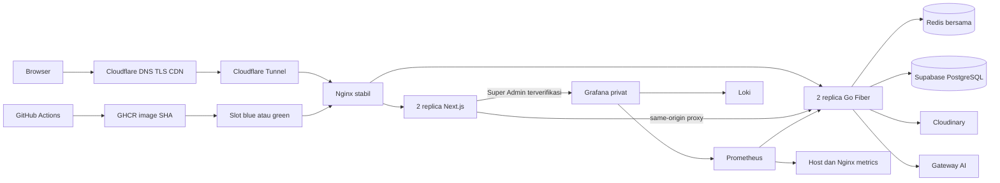

# Arsitektur production SKOMDA

Referensi pemilik proyek dan operator VPS, diperbarui 4 Oktober 2026. Implementasi di Git harus dibedakan dari hasil pengujian live.

## Keputusan

- Demo tetap di `linear.smktelkom-sidoarjo.my.id`; promosi domain utama menunggu persetujuan pemilik.
- Next.js untuk website/CMS; Go Fiber production, Gin tetap dipelihara dan diuji.
- PostgreSQL Supabase adalah sumber data production, tanpa fallback SQLite ketika gagal.
- Cloudinary menyimpan media asli dan menyajikan turunan teroptimasi.
- Satu VPS: Nginx, dua frontend, dua backend, Redis, Cloudflare Tunnel, Prometheus, Loki, Grafana.
- CD otomatis branch `deploy` setelah pemeriksaan dan scan image lulus; MFA di luar cakupan.
- Super Admin mengelola monitoring, audit dan provisioning Editor; Editor mengelola konten/CRUD.
- Target evaluasi 1.000 pengguna bersamaan terhadap VPS. Ini bukan janji 1.000 request/detik atau 1.000 sesi AI sekaligus.

## Aliran sistem

Hostname Tunnel `frontend:3000` dan `backend:8080` menunjuk ke Nginx pada jaringan privat `skomda-runtime`. Nginx memilih replika dengan `least_conn`. Browser admin memakai `/api/backend`; Next.js meneruskan permintaan ke backend pasangan pada slot yang sama. Host API terpisah tetap tersedia untuk API publik dan health check. Port aplikasi, Redis, Grafana, Prometheus, dan Loki tidak dipublikasikan ke internet. TLS publik berakhir di Cloudflare; HTTP dipakai dalam jaringan Docker privat. Webuzo tetap berjalan.

## Komponen dan kontrol

| Area | Implementasi | Batas/prasyarat |
|---|---|---|
| Frontend | Next.js standalone, media responsif, Cloudinary `f_auto`, kualitas foto 85/90, analytics dengan persetujuan | Gambar asli dipertahankan; audit visual dan perangkat perlu bukti live. |
| API | Fiber production dan Gin alternatif, batas waktu query, validasi input dan error | Gangguan layanan pendukung dilaporkan; konten palsu tidak disisipkan. |
| Database | Role `skomda_runtime` tanpa SUPERUSER/BYPASSRLS/DDL; pool 8 koneksi terbuka dan 2 idle per replika | Dua replika: maksimal 16 koneksi; dua slot saat CD: maksimal 32. Sesuaikan dengan kapasitas pooler. |
| Migrasi | SQL Goose di dalam image, ledger privat `skomda_internal`, koneksi admin hanya di `backend/migrate.env` | Migrasi wajib kompatibel dengan release lama; rollback image tidak membatalkan DDL. |
| Storage | Upload Cloudinary dan turunan WebP; gambar asli dipertahankan | Pemilik perlu menjaga akses pemulihan akun dan backup media independen. |
| Auth | JWT HS256 issuer/expiry/algorithm checks; cookie HttpOnly/Secure/SameSite; role terbaru dari DB | URL login tersembunyi bukan kontrol keamanan. MFA di luar cakupan. |
| Permissions | Editor CRUD; Super Admin monitoring, audit, provisioning Editor | Otorisasi backend wajib meskipun UI dijaga. |
| Hosting | Ubuntu VPS, Compose infrastructure/release terpisah | Satu VPS tetap satu titik kegagalan host. |
| CI/CD | Test/vet/typecheck/lint/build, Trivy untuk High/Critical yang dapat diperbaiki, publish SHA, CD otomatis | Environment `demo` tanpa required reviewers; kebijakan branch `deploy`; secrets privat. |
| Security/RLS | RLS pada 17 tabel, grants runtime eksplisit, pencabutan grants aplikasi untuk `anon`/`authenticated` | Backend mengakses PostgreSQL langsung; Data API dimatikan pemilik; grants perlu diaudit ulang setelah migrasi. |
| Rate limiting | Counter Redis atomik bersama untuk login, AI, formulir, tiket, dan upload | Jika Redis yang dikonfigurasi gagal, permintaan terkait ditolak. |
| Cache/CDN | Cache GET publik di Redis selama 30 detik, invalidasi generasi, satu proses pengisi cache bersama | Tidak menyimpan auth, admin, data privat, atau mutasi di cache. Redis memakai `noeviction` dan bukan sumber data utama. |
| Load balancing | Nginx `least_conn`, retry terbatas, keepalive, 2 replika tiap aplikasi | Mutasi tidak diulang sesudah penulisan atau respons sebagian; bukan HA lintas host. |
| Logs/metrics | Metadata tanpa body/query/IP/secret; Loki, Prometheus, CPU/RAM/disk/PID host, dan Grafana | Grafana hanya lewat proxy Super Admin; identitas dari caller dibuang, server memvalidasi ulang role. |
| Recovery | Health check, penghentian bertahap, slot sebelumnya dipertahankan, backup terenkripsi, restore terisolasi | RPO 24 jam/RTO 4 jam adalah sasaran, belum SLA; offsite terjadwal dan alert memerlukan tujuan dari pemilik. |
| GA4 | Pageview publik setelah persetujuan; route sensitif dikecualikan | Measurement ID belum diberikan; tracking nonaktif. |
| UI/UX analytics | Clarity setelah persetujuan, masking formulir, pengecualian admin/login/formulir sensitif | Project ID belum diberikan; tidak merekam sebelum persetujuan. |

## CD dan rollback

1. CI membuat image immutable `sha-<commit penuh>`, scan sebelum publish.
2. VPS mengunci deploy dengan `flock`; file environment wajib memakai mode `600`.
3. Infrastruktur stabil dan slot aktif tetap berjalan.
4. Slot tidak aktif dibersihkan; pull image, jalankan migrasi kompatibel.
5. Dua frontend dan dua backend kandidat harus sehat sebelum traffic dialihkan.
6. Konfigurasi Nginx divalidasi, lalu di-reload secara bertahap. Probe frontend/API wajib lulus. Kegagalan mengembalikan pointer sebelumnya.
7. Slot sebelumnya dipertahankan untuk rollback dan fallback `/_next/static/` bagi browser yang masih membuka release lama.

Gunakan `scripts/rollback-demo.sh` dari repo, atau `./rollback-demo.sh` pada direktori deployment VPS. Jangan menjalankan `compose down` pada infrastruktur atau slot aktif untuk release rutin. Upgrade proxy, Tunnel, atau infrastruktur memerlukan rencana transisi tersendiri; release aplikasi tidak membuat semua upgrade infrastruktur otomatis bebas gangguan.

## Kapasitas VPS

Provider membatasi seluruh PID/thread ke **500**, selain kapasitas RAM 4 GB dan 8 CPU. Batas ini ditemukan ketika Docker gagal membuat thread. Jumlah worker/thread Apache lama diturunkan; `GOMAXPROCS` Go/containerd dibatasi; metrik PID dan aturan alert ditambahkan.

RAM container dibatasi: backend 192 MiB, frontend 384 MiB, Redis 192 MiB, Nginx 96 MiB, serta Prometheus/Loki/Grafana masing-masing 256 MiB. Dua slot selama CD memerlukan kapasitas tambahan. Pantau koneksi DB, RAM, dan PID sebelum menambah replika atau menjalankan restore.

## AI

Input, riwayat, dan output dibatasi; batas waktu ditetapkan; maksimal 16 proses AI aktif dikendalikan dengan lease Redis bersama. Instruksi pengguna tidak menjadi instruksi sistem; konten tidak tepercaya disaring; model tidak diberi tools atau secrets. Saat gateway gagal, aplikasi melaporkan kegagalan tanpa mengarang fakta sekolah. Guard heuristik tidak menjamin kebal terhadap seluruh jailbreak atau halusinasi. Audit harus mencatat prompt yang diuji, hasil, dan latency; kapasitas AI dinilai terpisah dari browsing.

## Tahap dan bukti

### A — Demo aman

Tunnel aktif; frontend dan health API publik pernah diverifikasi dengan status `200`. Origin internal HTTP diperbaiki untuk mengatasi error TLS handshake. Domain utama belum dipromosikan.

### B — Data dan operasi

Dump schema lengkap dicocokkan sebelum baseline database existing dicatat. Migrasi 2 menerapkan role, grants, dan RLS. Role runtime diuji dalam transaksi yang dibatalkan; `.env` runtime diganti; koneksi admin dipisahkan untuk migrator.

Backup format custom dienkripsi dengan AES-256-CBC/PBKDF2-200000 dan HMAC-SHA256. Backup 4 Oktober berhasil direstore pada Postgres tanpa jaringan: 17 tabel dan ledger versi 2 ditemukan; production tidak ditimpa. Archive terenkripsi disalin ke komputer pemilik; recovery key disimpan terpisah dengan ACL Windows terbatas. Backup lokal harian dengan retensi 7 hari aktif. Pengiriman offsite terjadwal dan notifikasi menunggu tujuan serta kredensial.

### C — Performa, observabilitas dan analitik

Redis bersama, load balancer, Grafana/Prometheus/Loki, dan optimasi media diimplementasikan. Audit fungsi, perangkat, dan keamanan live dilakukan setelah release baru terpasang, diikuti ramp/spike/soak terhadap VPS. SHA, workload, latency, dan error hasil pengujian harus disimpan. GA4/Clarity nonaktif tanpa ID.

### D — Bukti kapasitas dan promosi

Kesiapan dinilai dari workload yang benar-benar lulus, bukan status CI saja. Syaratnya: audit akses privat, monitoring, restore/rollback, ketersediaan selama CD, dan load test terukur. Domain utama memerlukan persetujuan pemilik setelah bukti ditinjau.

## Dokumen operasional

- [Deployment](demo-vps-runbook.md)
- [Backup/recovery](backup-and-recovery-runbook.md)
- [Monitoring/insiden](monitoring-and-incidents.md)
- [Supabase runtime role](supabase-runtime-role-runbook.md)
- [Authorization audit](security-authorization-audit.md)
- [Media/frontend audit](frontend-performance-and-admin-audit.md)
- [Final audit plan](final-audit-plan.md)

## Memerlukan pemilik

Tujuan offsite otomatis, channel notifikasi, ID GA4/Clarity opsional, akses pemulihan akun Supabase/Cloudinary, kebijakan retensi, serta persetujuan promosi domain utama. HA host memerlukan mesin atau origin tambahan.
